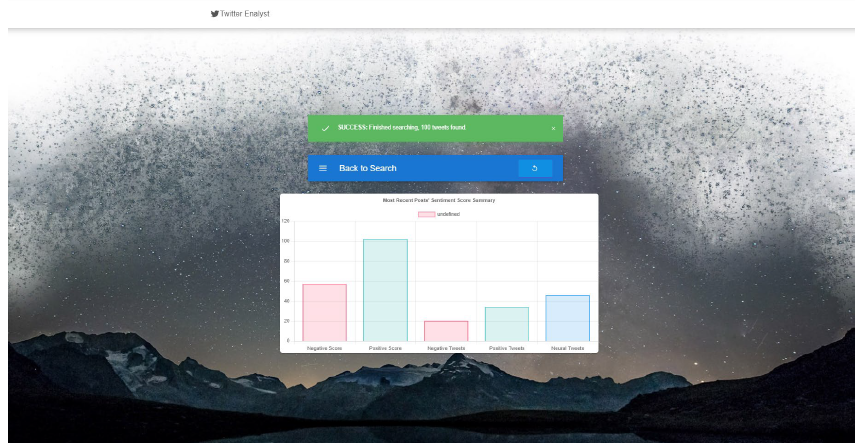

#Twitter Analyst

<!--

<!-- PROJECT LOGO -->
 

  <h3 align="center">Twitter Analyst Application</h3>

<!-- ABOUT THE PROJECT -->
## About The Project

 

A scalable website for searching trending keywords and visualizing the sentiment score on the real-time chart. Using Twitter API, Sentiment npm module, Web RTC, Google Trend API, DynamoDB, Redis and AWS for scaling  

### Built With
* [React.js](https://reactjs.org/)
* [Express.js](https://expressjs.com/)
* Sentiment npm
* DynamoDB
* Elasticache Redis

